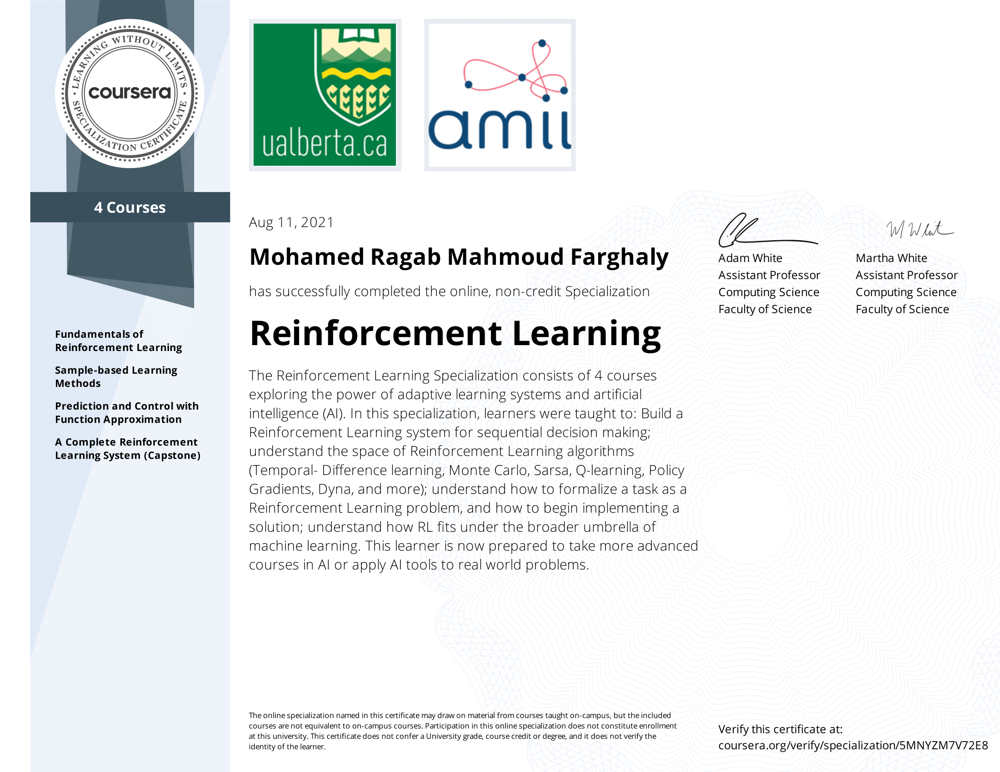

# Reinforcement Learning Specialization

these are only the notebooks and my solutions to the assignments and practice exercises

These course materials belong entirely to `University of Alberta` & `Alberta Machine Intelligence Institute` which can be found [here](https://www.coursera.org/specializations/reinforcement-learning) and [here](https://www.ualberta.ca/admissions-programs/online-courses/reinforcement-learning/index.html). The solutions are my work during my enrollment of the specialization.

